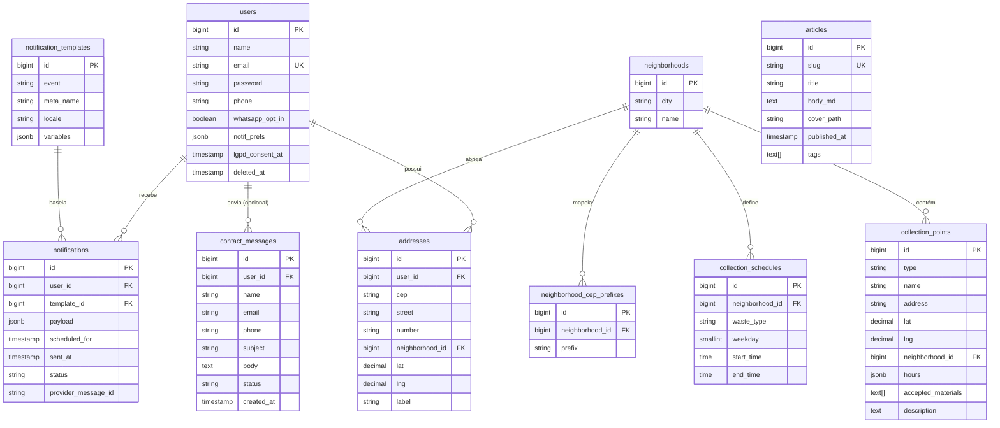

# Eco City — Arquitetura

Complemento técnico do `project-specs.md`. Cobre modelo de dados (ER), contrato da API REST e decisões derivadas.

---

## 1. Diagrama ER



### Restrições e índices relevantes

| Tabela | Regra |
|---|---|
| `users` | `UNIQUE(email)`. `phone` único quando não nulo. `soft delete` via `deleted_at`. |
| `addresses` | índice em `(user_id)`; FK `neighborhood_id` nullable (CEP pode cair fora da cidade-piloto). |
| `neighborhoods` | `UNIQUE(city, name)`. |
| `neighborhood_cep_prefixes` | `UNIQUE(prefix)`; índice em `prefix varchar_pattern_ops` para `LIKE 'x%'`. |
| `collection_schedules` | `UNIQUE(neighborhood_id, waste_type, weekday, start_time)`. `weekday` ∈ 0–6 (domingo=0). |
| `collection_points` | `CHECK type IN ('reciclagem','especial')`. Índice em `(type)`, `(neighborhood_id)`, `(lat, lng)`. |
| `articles` | `UNIQUE(slug)`. Índice parcial `WHERE published_at IS NOT NULL`. |
| `notifications` | Índices em `(scheduled_for, status)` e `(user_id, scheduled_for)`. |
| `contact_messages` | `status` ∈ `novo`, `em_andamento`, `resolvido`. |

### Enumerações

- `waste_type`: `reciclavel`, `rejeito`, `organico`, `especial`.
- `collection_points.type`: `reciclagem`, `especial`.
- `accepted_materials`: `papel`, `plastico`, `vidro`, `metal`, `eletronico`, `pilha_bateria`, `lampada`, `oleo_cozinha`, `medicamento`.
- `notification_templates.event`: `collection_reminder`.
- `notifications.status`: `pending`, `queued`, `sent`, `delivered`, `failed`, `read`.

### Consultas-chave (sem PostGIS)

**Resolver CEP → bairro (prefixo mais específico):**

```sql
SELECT n.*
FROM neighborhood_cep_prefixes p
JOIN neighborhoods n ON n.id = p.neighborhood_id
WHERE :cep LIKE p.prefix || '%'
ORDER BY LENGTH(p.prefix) DESC
LIMIT 1;
```

**Pontos num raio (Haversine):**

```sql
SELECT *, (
  6371 * acos(
    cos(radians(:lat)) * cos(radians(lat)) *
    cos(radians(lng) - radians(:lng)) +
    sin(radians(:lat)) * sin(radians(lat))
  )
) AS distance_km
FROM collection_points
WHERE lat BETWEEN :lat - 0.1 AND :lat + 0.1
  AND lng BETWEEN :lng - 0.1 AND :lng + 0.1
HAVING distance_km <= :radius_km
ORDER BY distance_km;
```

A bounding box (`BETWEEN`) pré-filtra antes da função cara; funciona bem com índice em `(lat, lng)`.

---

## 2. API REST — `/api/v1`

**Autenticação:** Laravel Sanctum em modo SPA. Front envia cookies (`laravel_session`, `XSRF-TOKEN`). Rotas autenticadas exigem middleware `auth:sanctum`.

**Formato:**
- Request/response em JSON.
- Paginação: `?page=N&per_page=M` (padrão 15, máximo 100).
- Erros 422 seguem o formato padrão do Laravel:
  ```json
  { "message": "...", "errors": { "campo": ["msg1"] } }
  ```
- Rate limit: `throttle:60,1` por IP em rotas públicas; `throttle:10,1` em `POST /auth/*` e `POST /contact-messages`.

### 2.1 Rotas públicas

#### Geografia e CEP

| Método | Rota | Descrição |
|---|---|---|
| `GET`  | `/neighborhoods` | Lista bairros da cidade-piloto. |
| `GET`  | `/neighborhoods/{id}` | Detalhe do bairro + cronograma. |
| `GET`  | `/neighborhoods/resolve?cep=86300000` | Resolve CEP → bairro (ou 404 se fora da cidade). |
| `GET`  | `/cep/{cep}` | Proxy ViaCEP + enriquecimento com `neighborhood_id` se aplicável. |

**Exemplo — `GET /api/v1/neighborhoods/resolve?cep=86300000`**
```json
{
  "data": {
    "id": 3,
    "city": "Cornélio Procópio",
    "name": "Centro",
    "matched_prefix": "86300"
  }
}
```

#### Coletas

| Método | Rota | Descrição |
|---|---|---|
| `GET`  | `/neighborhoods/{id}/schedule` | Cronograma semanal do bairro. |
| `GET`  | `/schedule?cep=86300000&month=2026-05` | Calendário mensal por CEP (visitante). |

**Exemplo — `GET /api/v1/schedule?cep=86300000&month=2026-05`**
```json
{
  "data": {
    "neighborhood": { "id": 3, "name": "Centro" },
    "month": "2026-05",
    "days": [
      { "date": "2026-05-04", "collections": [
        { "waste_type": "reciclavel", "start_time": "07:00", "end_time": "11:00" }
      ]},
      { "date": "2026-05-06", "collections": [
        { "waste_type": "rejeito", "start_time": "19:00", "end_time": "22:00" }
      ]}
    ]
  }
}
```

#### Pontos de coleta

| Método | Rota | Descrição |
|---|---|---|
| `GET`  | `/collection-points` | Lista pontos. Filtros: `type`, `material`, `near=lat,lng`, `radius=5`, `bbox=minLng,minLat,maxLng,maxLat`. |
| `GET`  | `/collection-points/{id}` | Detalhe. |

**Exemplo — `GET /api/v1/collection-points?type=especial&material=eletronico&near=-23.181,-50.651&radius=5`**
```json
{
  "data": [
    {
      "id": 12,
      "type": "especial",
      "name": "Ecoponto Centro",
      "address": "R. Paraná, 123",
      "lat": -23.1823,
      "lng": -50.6487,
      "neighborhood": { "id": 3, "name": "Centro" },
      "hours": { "mon": "08:00-17:00", "sat": "08:00-12:00" },
      "accepted_materials": ["eletronico", "pilha_bateria"],
      "distance_km": 0.42
    }
  ],
  "meta": { "total": 1 }
}
```

#### Conteúdo

| Método | Rota | Descrição |
|---|---|---|
| `GET`  | `/articles` | Lista publicada. Filtros: `tag`, `q`. |
| `GET`  | `/articles/{slug}` | Artigo único. |

#### Contato

| Método | Rota | Descrição |
|---|---|---|
| `POST` | `/contact-messages` | Envia mensagem de contato. Throttle 10/min. |

### 2.2 Autenticação

| Método | Rota | Body principal |
|---|---|---|
| `POST` | `/auth/register` | `name, email, password, phone, lgpd_consent, whatsapp_opt_in?` |
| `POST` | `/auth/login` | `email, password` |
| `POST` | `/auth/logout` | — (autenticado) |
| `POST` | `/auth/forgot-password` | `email` |
| `POST` | `/auth/reset-password` | `token, email, password` |
| `GET`  | `/auth/me` | — (autenticado) |

### 2.3 Rotas do cidadão (`auth:sanctum`)

#### Endereços

| Método | Rota |
|---|---|
| `GET`  | `/me/addresses` |
| `POST` | `/me/addresses` |
| `PUT`  | `/me/addresses/{id}` |
| `DELETE` | `/me/addresses/{id}` |

#### Preferências e WhatsApp

| Método | Rota | Descrição |
|---|---|---|
| `GET`  | `/me/preferences` | Retorna `notif_prefs`. |
| `PUT`  | `/me/preferences` | Atualiza horário, antecedência, tipos, pausa. |
| `POST` | `/me/whatsapp/opt-in` | Ativa lembretes (seta `whatsapp_opt_in=true`). Exige `phone` preenchido no cadastro. |
| `POST` | `/me/whatsapp/opt-out` | Desativa lembretes (seta `whatsapp_opt_in=false`). |

**Exemplo — `PUT /api/v1/me/preferences`**
```json
{
  "reminder_time": "19:00",
  "lead_time": "evening_before",
  "waste_types": ["reciclavel", "rejeito"],
  "paused": false
}
```

#### Calendário pessoal

| Método | Rota | Descrição |
|---|---|---|
| `GET`  | `/me/schedule?month=2026-05&address_id=7` | Calendário do endereço principal (ou `address_id`). |

#### LGPD (RNF07)

| Método | Rota | Descrição |
|---|---|---|
| `GET`  | `/me/export` | JSON com todos os dados pessoais. |
| `DELETE` | `/me` | Soft-delete + anonimização de histórico. |

### 2.4 Webhooks

| Método | Rota | Descrição |
|---|---|---|
| `GET`  | `/webhooks/whatsapp` | Verificação da Meta (`hub.verify_token`). |
| `POST` | `/webhooks/whatsapp` | Eventos da Meta: status de entrega (`sent`, `delivered`, `read`, `failed`) e respostas recebidas (atualiza opt-in/out). Autenticado por `X-Hub-Signature-256`. |

### 2.5 Admin

**Sem endpoints REST de admin.** Todo CRUD administrativo vai pelo **Filament em `/admin`**, que opera direto nos models Eloquent. Isso mantém a superfície da API pública mínima.

---

## 3. Fluxos críticos

### 3.1 Registro com opt-in WhatsApp

Opt-in por **checkbox no formulário de cadastro** — simples, sem confirmação via template. O cidadão pode alternar depois em Preferências (`POST /me/whatsapp/opt-in` / `opt-out`).

```
Cidadão       Next.js              Laravel API
   │ preenche form │                    │
   │ ☑ receber lembretes no WhatsApp    │
   │──────────────▶│                    │
   │               │ POST /auth/register                 
   │               │ { ..., phone, whatsapp_opt_in: true }
   │               │───────────────────▶│
   │               │                    │ cria user com
   │               │                    │ whatsapp_opt_in = true
   │               │◀───────────────────│ 201 + sessão
```

**Regras:**
- `whatsapp_opt_in = true` só é aceito se `phone` for fornecido no mesmo request (validação no `RegisterRequest`).
- Checkbox fica **desmarcado por padrão** (RNF07 — consentimento ativo).
- Label sugerida: *"Quero receber lembretes de coleta pelo WhatsApp neste número."*

### 3.2 Envio diário de lembretes (RF04)

1. **Cron** executa `php artisan schedule:run` a cada minuto.
2. **Scheduler** dispara `DispatchCollectionReminders` às 00:10 diário.
3. Job busca cidadãos com `whatsapp_opt_in=true`, não pausados, com endereço em bairro que tem coleta no dia seguinte (respeitando `lead_time`).
4. Enfileira um `SendWhatsAppReminder` por cidadão.
5. Worker (`queue:work`) consome e chama Meta Cloud com o template aprovado.
6. Webhook atualiza `notifications.status` conforme `sent`/`delivered`/`read`/`failed`.

### 3.3 Busca pública por CEP (RF08)

```
  digita CEP  →  front chama GET /cep/{cep}
                     ↓
         Laravel consulta ViaCEP (cache 30d)
                     ↓
         resolve neighborhood_id via prefixo
                     ↓
         retorna endereço + bairro (+ link pro calendário)
```

---

## 4. Convenções de erro

| Status | Uso |
|---|---|
| `200` | OK |
| `201` | Criado |
| `204` | Sem conteúdo (DELETE) |
| `401` | Não autenticado |
| `403` | Autenticado mas sem permissão (ex.: endereço de outro user) |
| `404` | Recurso não encontrado |
| `409` | Conflito (ex.: e-mail já cadastrado em registro duplicado) |
| `422` | Validação |
| `429` | Rate limit |
| `5xx` | Erro do servidor — responder `{ "message": "..." }` sem stack trace em prod |
